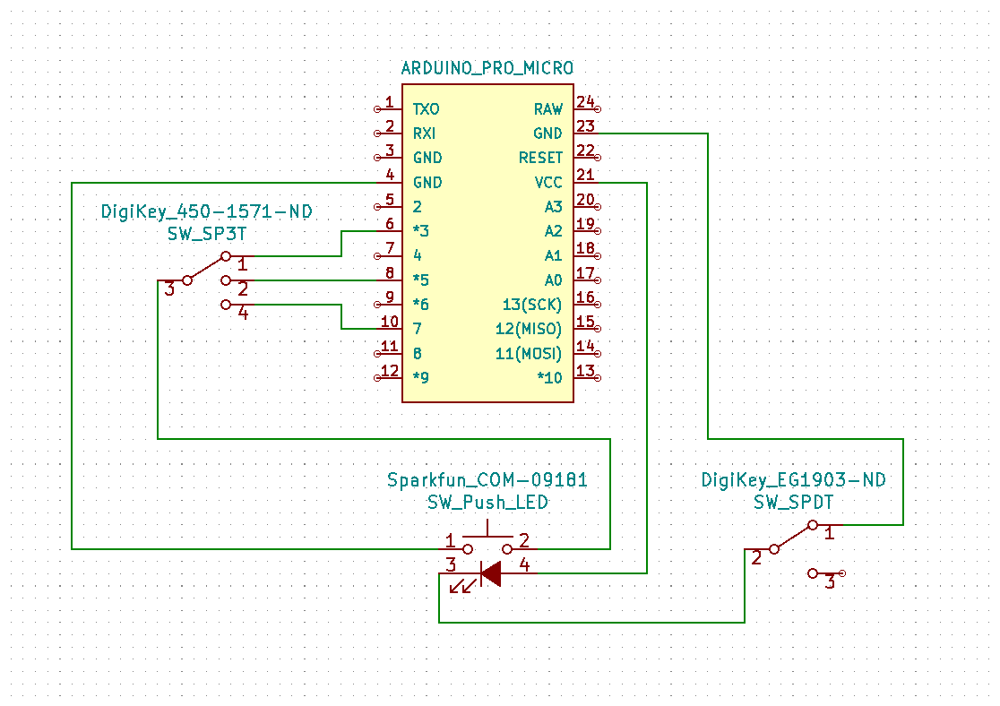
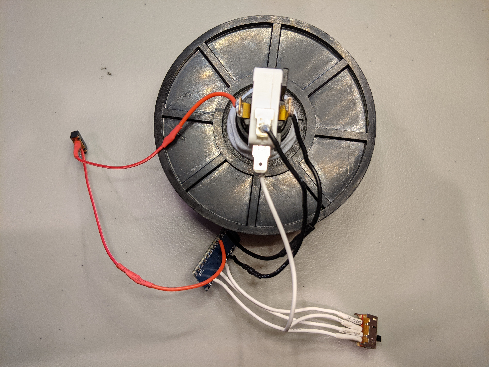

# Zoomender

A simple plug-and-play device for ending Zoom calls—no software installation required! Will work for Linux, Windows, and Apple operating systems.

#TODO: Add gif

## Hardware

### BOM

In addition to standard electronics equipment and access to a 3D-printer:

| Item                       | Price (USD) | Quantity | Source                                                       |
| -------------------------- | ----------- | -------- | ------------------------------------------------------------ |
| Arduino Pro Micro*         | 17.49 / 3   | 1        | Amazon  [ASIN B01MTU9GOB](https://www.amazon.com/HiLetgo-Atmega32U4-Bootloadered-Development-Microcontroller/dp/B01MTU9GOB/ref=sr_1_1_sspa?dchild=1&keywords=arduino+pro+micro&qid=1614562625&sr=8-1-spons&psc=1&spLa=ZW5jcnlwdGVkUXVhbGlmaWVyPUEyV1BVTFBUNEY2NjhHJmVuY3J5cHRlZElkPUEwMTk3NDQwM1RON1BNTkJSNjBGSyZlbmNyeXB0ZWRBZElkPUEwMzI5Nzg0MlpFV1c0TUtIVElGWSZ3aWRnZXROYW1lPXNwX2F0ZiZhY3Rpb249Y2xpY2tSZWRpcmVjdCZkb05vdExvZ0NsaWNrPXRydWU=) |
| big dome push-button (red) | 11.95       | 1        | Sparkfun  [COM-09181](https://www.sparkfun.com/products/9181) |
| SP3T switch                | 1.25        | 1        | DigiKey  [450-1571-ND](https://www.digikey.com/en/products/detail/te-connectivity-alcoswitch-switches/1825255-8/1202283?s=N4IgTCBcDaICwFYAMBaAjAg7GlA7AJiALoC%2BQA) |
| SPDT switch**              | 0.65        | 1        | DigiKey  [EG1903-ND](https://www.digikey.com/en/products/detail/e-switch/EG1218/101726) |

**Note:* I used an Arduino Pro Micro clone, to cut down on price. So long as it has an ATmega 32U4 processor, it should be able to spoof a HID just as well as the real thing, no problem. 

***Note*: The SPDT switch isn’t really necessary. It just controls the LED built into the push button. I understand some people have their computers near their bed, however, and so the option to turn off the LED is sometimes desirable. 

### Circuit

A literal schematic is shown below. The exact GND pins that were used are depicted (not that it matters):

A complementary photograph:

### Assembly

1. Print the [`main.stl`](/hardware/STLs/main.stl) and the [`base.stl`](/hardware/STLs/base.stl). I used the default settings for PLA at 0.2 um layer height on my Prusa MK3S. 
2. Solder or crimp the connections together, as illustrated in the schematic. Making connections on the terminals of the small SPDT and SP3T switches can be a little tricky. I found that female crimp pins meant for 0.1” housing (like the kind you find on breadboard jumper cables) worked well, when combined with some solder. I then added some heat-shrink to prevent shorting the switch terminals. Alternatively, you can take a more professional approach.
3. Press-fit the push-button, switches and Pro Micro into their respective slots of the main body. If your print settings were well tuned, the components should fit snugly, without complaints. Otherwise, don’t be afraid to use some epoxy or hot glue. 
4. Screw the base into the bottom of the main, via the printed threads. 

#TODO: Attach photograph

## Firmware

Just upload the [`firmware.ino`](/firmware/firmware.ino) file via the Arduino IDE and you’re ready to go! 

## Extensions

A wireless Bluetooth version is very possible, but it adds to the price. We just need to replace the Arduino Pro Micro board with one that is Bluetooth-capable. Adafruit’s version of an ESP32 board ([SKU 3405](https://www.adafruit.com/product/3405)) supports both classic and low-energy Bluetooth connections, and can easily spoof a HID, when combined with [T-vK’s ESP32 BLE Keyboard library](https://github.com/T-vK/ESP32-BLE-Keyboard). It costs over three times that of a single Pro Micro clone, however. Cheaper ESP32 boards can be found on Amazon and AliExpress, but the Adafruit one is nice because when both the LiPo battery and the USB are connected, the board will automatically switch over to USB for power, while simultaneously charging the battery at 200 mA—the sort of behaviour we might expect out of a consumer-grade Bluetooth device. Simultaneous delivery of multiple power sources on cheaper ESP32 boards can damage the board, and in some cases, the host computer. I’ll update the repo with a Bluetooth alternative, sometime in the future. 